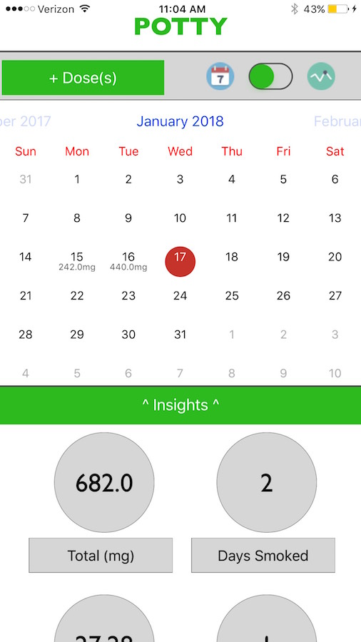

# Potty

Potty lets users track their medical or recreational marijuana consumption. All data is stored locally, on your phone, and the app is totally free! Keep track of what you're spending, what you're consuming, and how it effects you over the short to long term with insights from Potty.

DISCLAIMER: I AM NOT A MEDICAL EXPERT AND I MADE THIS APP FOR FUN, NOT TO BE USED SERIOUSLY OR AS AN ACTUAL MEDICAL/HEALTH APP. 
